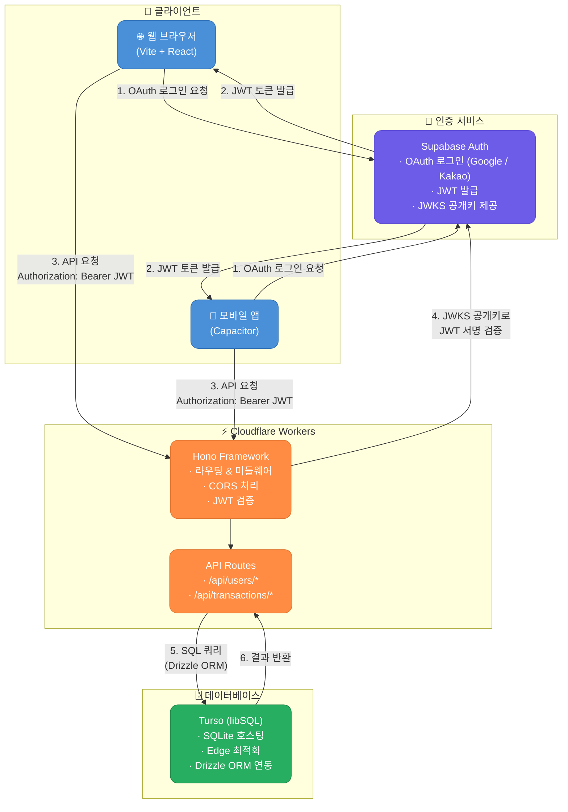
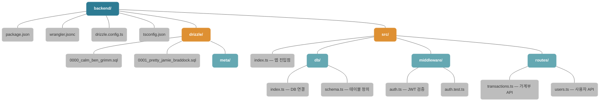
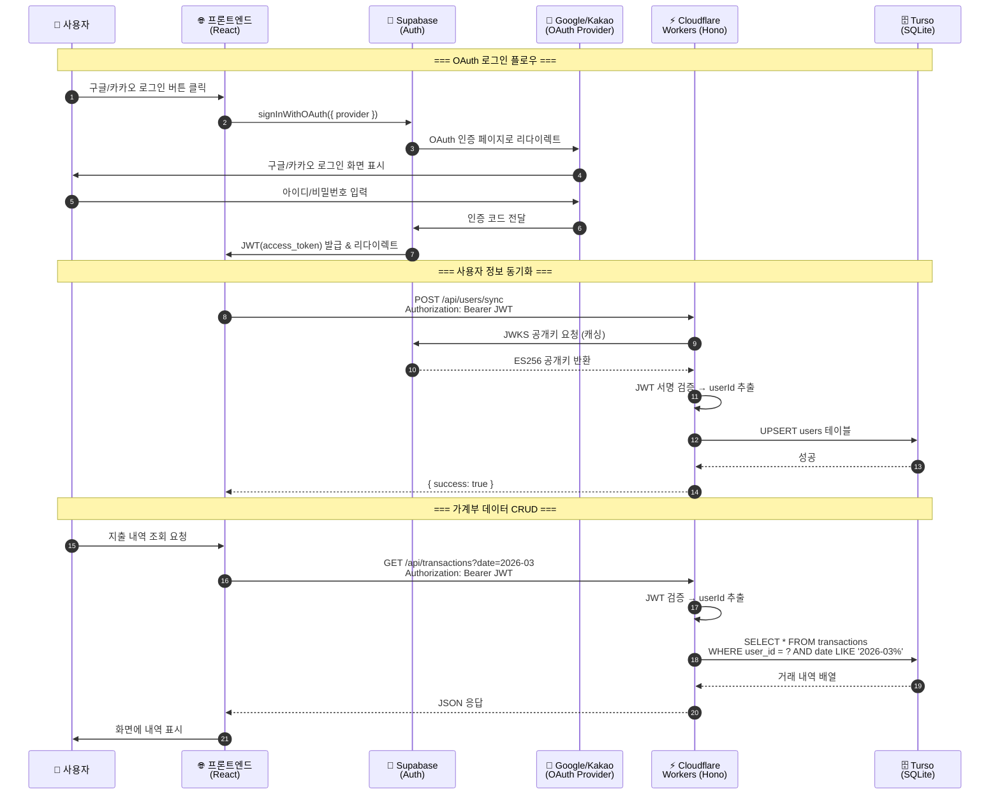

# Budget App — Backend Architecture

백엔드 시스템의 아키텍처, 폴더 구조, 데이터 흐름을 하나의 문서로 정리합니다.
각 외부 서비스(Cloudflare Workers, Turso, Supabase, Hono)가 시스템에 어떤 역할로 관여하는지 다이어그램과 함께 설명합니다.

---

## 1. System Architecture (시스템 아키텍처)

### 각 스택의 역할 요약

| 스택 | 역할 | 데이터 흐름에서의 위치 |
|------|------|----------------------|
| **Cloudflare Workers** | 서버리스 런타임 환경. 전 세계 Edge에서 코드 실행 | 모든 API 요청의 진입점 (컴퓨팅) |
| **Hono** | 경량 웹 프레임워크. 라우팅, 미들웨어, CORS 처리 | Workers 위에서 HTTP 요청을 받아 분배 |
| **Supabase** | OAuth 로그인 + JWT 발급/검증용 공개키(JWKS) 제공 | 인증 계층 (로그인 ↔ 토큰 검증) |
| **Turso** | SQLite 기반 분산 DB. Edge 환경에 최적화 | 데이터 저장소 (유저, 거래내역) |
| **Drizzle ORM** | 타입 안전한 SQL 빌더. 스키마 정의 + 마이그레이션 | 백엔드 ↔ DB 사이의 쿼리 추상화 계층 |

---

## 2. Folder Structure (폴더 구조)

---

## 3. Data Flow (데이터 흐름)

사용자가 로그인하고, 가계부 내역을 조회하는 전체 플로우입니다.

---

## 4. 기술 스택 연결 상세

### Cloudflare Workers (런타임)
- 모든 백엔드 코드가 실행되는 **서버리스 환경**
- `wrangler.jsonc`에 환경 변수(Turso URL, Supabase Secret) 설정
- 전 세계 Edge 노드에서 실행되어 **저지연 응답** 제공

### Hono (웹 프레임워크)
- Cloudflare Workers 위에서 돌아가는 **초경량 라우터**
- `src/index.ts`에서 CORS, 인증 미들웨어, 라우트를 조립
- 미들웨어 체인: `CORS → authMiddleware → Route Handler`

### Supabase (인증)
- 프론트엔드에서 **OAuth 로그인**(Google/Kakao)을 처리
- JWT 토큰을 발급하고, 백엔드는 **JWKS 공개키**로 토큰 진위를 검증
- 백엔드는 Supabase DB를 사용하지 않고 **인증 기능만** 활용

### Turso + Drizzle ORM (데이터 저장)
- **Turso**: Edge 환경에 최적화된 SQLite 호스팅 서비스 (libSQL 프로토콜)
- **Drizzle ORM**: TypeScript 타입 안전 쿼리 빌더 + 마이그레이션 관리
- `db/schema.ts`에서 `users`, `transactions` 테이블 정의
- `db/index.ts`에서 Turso 클라이언트를 Drizzle로 래핑하여 사용
