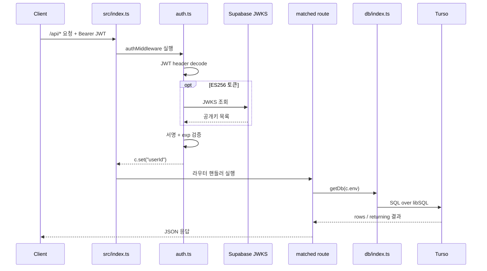
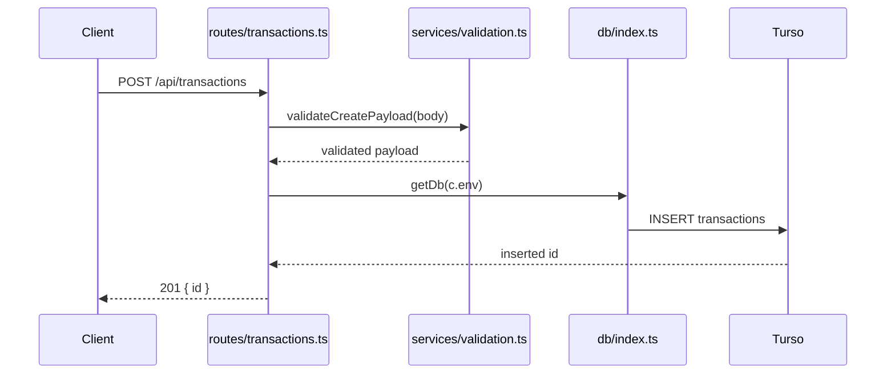
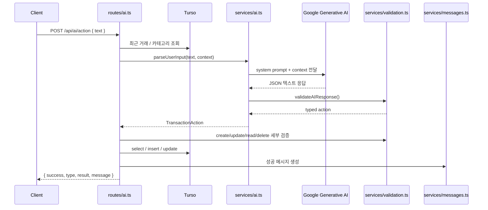

# FastSaaS Backend 코드 기준 통합 가이드

이 문서는 `FastSaaS02_Track01_1/backend`의 현재 실제 소스코드를 기준으로 백엔드 구조를 정리한 통합 문서입니다.

- 추상 설계가 아니라 현재 존재하는 파일과 경로를 기준으로 설명합니다.
- 기준 소스: `src/index.ts`, `src/routes/*`, `src/services/*`, `src/db/*`, `src/middleware/*`, `tests/*`
- 기존 `backend_architecture.md`와 `backend_structure.md` 내용을 이 문서로 합쳤습니다.

## 1. 시스템 아키텍처

```mermaid
flowchart TD
    subgraph Clients["Frontend Clients"]
        direction LR
        Web["🌐 Web App<br/>(Vite / React)"]
        Mobile["📱 Mobile App<br/>(Capacitor)"]
    end

    subgraph Worker["Cloudflare Workers (Backend)"]
        direction TB
        App["App Entry (src/index.ts)<br/>Hono Instance"]
        Cors["CORS Middleware<br/>(localhost, pages.dev,<br/>capacitor)"]
        Auth["Auth Middleware<br/>(src/middleware/auth.ts)<br/>JWT verify + userId"]
        RouteMount["Mounted Routes<br/>/api/transactions<br/>/api/users<br/>/api/ai"]
        Tx["Transactions Router<br/>(src/routes/transactions.ts)"]
        User["Users Router<br/>(src/routes/users.ts)"]
        AI["AI Router<br/>(src/routes/ai.ts)"]
<<<<<<< HEAD
        AISvc["Service Layer<br/>ai.ts / ai-report.ts / chat.ts<br/>validation.ts / messages.ts"]
=======
        AISvc["Service Layer<br/>ai.ts / validation.ts / messages.ts"]
>>>>>>> 63fba07758528cfcda93dfe5abdc09497aca712a
        DBClient["DB Client (src/db/index.ts)<br/>Stateless @libsql/client"]

        App --> Cors --> Auth --> RouteMount
        RouteMount --> Tx
        RouteMount --> User
        RouteMount --> AI
        AI --> AISvc
        Tx --> DBClient
        User --> DBClient
        AISvc --> DBClient
    end

    subgraph Data["Turso (Serverless SQLite)"]
        direction TB
        Schema["Schema (src/db/schema.ts)<br/>Drizzle ORM"]
        DB[("users / transactions DB")]
        Schema --> DB
    end

    Web -- "HTTP REST" --> App
    Mobile -- "HTTP REST" --> App
    DBClient -- "SQL over HTTP" --> DB
    Auth -. "JWKS / JWT verify" .-> Supabase["Supabase Auth<br/>JWT Secret + JWKS"]
    AISvc -. "Gemini API" .-> Gemini["Google Generative AI<br/>gemma-2-9b-it"]

    classDef client fill:#67C5E8,stroke:#1F6E8C,stroke-width:2px,color:#083344;
    classDef workerBox fill:#FF8616,stroke:#D96D08,stroke-width:2px,color:#FFFFFF;
    classDef note fill:#EFEFEF,stroke:#CFCFCF,stroke-width:1px,color:#444444;
    classDef dbBox fill:#0B5D6B,stroke:#083F49,stroke-width:2px,color:#FFFFFF;
    classDef external fill:#DCE9FF,stroke:#8AA7D6,stroke-width:1.5px,color:#23395B;

    class Web,Mobile client;
    class App,Cors,Auth,Tx,User,AI,AISvc,DBClient workerBox;
    class RouteMount note;
    class Schema,DB dbBox;
    class Supabase,Gemini external;

    style Clients fill:#FFF9D7,stroke:#D8C873,stroke-width:1px,color:#333333
    style Worker fill:#FFF9D7,stroke:#D8C873,stroke-width:1px,color:#333333
    style Data fill:#FFF9D7,stroke:#D8C873,stroke-width:1px,color:#333333
```

## 2. 레이어별 구성

| 레이어 | 사용 기술 | 실제 소스 |
| --- | --- | --- |
| Runtime | Cloudflare Workers, Wrangler | `wrangler.jsonc`, `src/index.ts` |
| HTTP | Hono, CORS | `src/index.ts` |
| Auth | 커스텀 JWT 검증, Supabase JWKS | `src/middleware/auth.ts` |
| Database | Turso, `@libsql/client`, Drizzle ORM | `src/db/index.ts`, `src/db/schema.ts`, `drizzle.config.ts` |
| Route Layer | Transactions, Users, AI 엔드포인트 | `src/routes/transactions.ts`, `src/routes/users.ts`, `src/routes/ai.ts` |
<<<<<<< HEAD
| Service Layer | Gemini 연동, 리포트 생성, 채팅 히스토리, 메시지 생성, 검증 | `src/services/ai.ts`, `src/services/ai-report.ts`, `src/services/chat.ts`, `src/services/messages.ts`, `src/services/validation.ts` |
=======
| Service Layer | Gemini 연동, 메시지 생성, 검증 | `src/services/ai.ts`, `src/services/messages.ts`, `src/services/validation.ts` |
>>>>>>> 63fba07758528cfcda93dfe5abdc09497aca712a
| Type Layer | AI 액션 타입 정의 | `src/types/ai.ts` |
| Test | Vitest | `vitest.config.ts`, `src/middleware/auth.test.ts`, `tests/*` |

## 3. 폴더 구조

### 3.1 구조 다이어그램

```mermaid
graph TD
    Backend["backend/"]

    Backend --- RootConfig["package.json<br/>wrangler.jsonc<br/>drizzle.config.ts<br/>tsconfig.json<br/>vitest.config.ts"]
    Backend --- RootEtc["README.md<br/>test_connection.js<br/>package-lock.json"]
    Backend --- Drizzle["drizzle/"]
    Backend --- Src["src/"]
    Backend --- Tests["tests/"]

    Src --- Index["index.ts"]
    Src --- Db["db/"]
    Src --- Middleware["middleware/"]
    Src --- Routes["routes/"]
    Src --- Services["services/"]
    Src --- Types["types/"]

    Db --- DbIndex("index.ts")
    Db --- DbSchema("schema.ts")

    Middleware --- Auth("auth.ts")
    Middleware --- AuthTest("auth.test.ts")

    Routes --- TxRoute("transactions.ts")
    Routes --- UserRoute("users.ts")
    Routes --- AIRoute("ai.ts")

    Services --- AISvc("ai.ts")
<<<<<<< HEAD
    Services --- AIReport("ai-report.ts")
    Services --- ChatSvc("chat.ts")
=======
>>>>>>> 63fba07758528cfcda93dfe5abdc09497aca712a
    Services --- Messages("messages.ts")
    Services --- Validation("validation.ts")

    Types --- AITypes("ai.ts")

    Drizzle --- SqlFiles("0000_*.sql<br/>0001_*.sql")
    Drizzle --- Meta("meta/")

<<<<<<< HEAD
    Tests --- Fixtures("fixtures/")
    Tests --- RouteTests("routes/")
    Tests --- ServiceTests("services/")
    Fixtures --- TestData("test-data.ts")
    RouteTests --- RouteTxTest("transactions.test.ts")
    RouteTests --- RouteAITest("ai.test.ts")
    ServiceTests --- AISvcTest("ai.test.ts")
    ServiceTests --- AIReportTest("ai-report.test.ts")
    ServiceTests --- ChatTest("chat.test.ts")
=======
    Tests --- RouteTests("routes/")
    Tests --- ServiceTests("services/")
    RouteTests --- RouteTxTest("transactions.test.ts")
    RouteTests --- RouteAITest("ai.test.ts")
>>>>>>> 63fba07758528cfcda93dfe5abdc09497aca712a
    ServiceTests --- MsgTest("messages.test.ts")
    ServiceTests --- ValTest("validation.test.ts")

    classDef mainFolder fill:#2D7B93,stroke:#2D7B93,stroke-width:2px,color:#fff,rx:8px,ry:8px,font-weight:bold;
    classDef folder fill:#DE9033,stroke:#DE9033,stroke-width:2px,color:#fff,rx:8px,ry:8px,font-weight:bold;
    classDef subFolder fill:#65A8B2,stroke:#65A8B2,stroke-width:2px,color:#fff,rx:8px,ry:8px,font-weight:bold;
    classDef file fill:#BDBDBD,stroke:#BDBDBD,stroke-width:2px,color:#333,rx:8px,ry:8px;

    class Backend mainFolder;
    class Drizzle,Src,Tests folder;
<<<<<<< HEAD
    class Db,Middleware,Routes,Services,Types,Fixtures,RouteTests,ServiceTests,Meta subFolder;
    class RootConfig,RootEtc,Index,DbIndex,DbSchema,Auth,AuthTest,TxRoute,UserRoute,AIRoute,AISvc,AIReport,ChatSvc,Messages,Validation,AITypes,SqlFiles,TestData,RouteTxTest,RouteAITest,AISvcTest,AIReportTest,ChatTest,MsgTest,ValTest file;
=======
    class Db,Middleware,Routes,Services,Types,RouteTests,ServiceTests,Meta subFolder;
    class RootConfig,RootEtc,Index,DbIndex,DbSchema,Auth,AuthTest,TxRoute,UserRoute,AIRoute,AISvc,Messages,Validation,AITypes,SqlFiles,RouteTxTest,RouteAITest,MsgTest,ValTest file;
>>>>>>> 63fba07758528cfcda93dfe5abdc09497aca712a
```

### 3.2 트리 보기

```txt
backend/
|-- README.md
|-- drizzle.config.ts
|-- package.json
|-- package-lock.json
|-- test_connection.js
|-- tsconfig.json
|-- vitest.config.ts
|-- wrangler.jsonc
|-- drizzle/
|   |-- 0000_calm_ben_grimm.sql
|   |-- 0001_pretty_jamie_braddock.sql
|   `-- meta/
|       |-- 0000_snapshot.json
|       |-- 0001_snapshot.json
|       `-- _journal.json
|-- src/
|   |-- index.ts
|   |-- db/
|   |   |-- index.ts
|   |   `-- schema.ts
|   |-- middleware/
|   |   |-- auth.ts
|   |   `-- auth.test.ts
|   |-- routes/
|   |   |-- ai.ts
|   |   |-- transactions.ts
|   |   `-- users.ts
|   |-- services/
|   |   |-- ai.ts
<<<<<<< HEAD
|   |   |-- ai-report.ts
|   |   |-- chat.ts
=======
>>>>>>> 63fba07758528cfcda93dfe5abdc09497aca712a
|   |   |-- messages.ts
|   |   `-- validation.ts
|   `-- types/
|       `-- ai.ts
`-- tests/
<<<<<<< HEAD
    |-- fixtures/
    |   `-- test-data.ts
=======
>>>>>>> 63fba07758528cfcda93dfe5abdc09497aca712a
    |-- routes/
    |   |-- ai.test.ts
    |   `-- transactions.test.ts
    `-- services/
<<<<<<< HEAD
        |-- ai.test.ts
        |-- ai-report.test.ts
        |-- chat.test.ts
=======
>>>>>>> 63fba07758528cfcda93dfe5abdc09497aca712a
        |-- messages.test.ts
        `-- validation.test.ts
```

### 3.3 폴더별 역할

| 경로 | 역할 |
| --- | --- |
| `backend/` | 실행, 배포, 마이그레이션, 테스트 설정이 모이는 루트 |
| `backend/drizzle/` | Drizzle이 생성한 SQL 마이그레이션과 스냅샷 |
| `backend/src/` | 실제 런타임 코드 |
| `backend/src/db/` | Turso 연결과 Drizzle 스키마 |
| `backend/src/middleware/` | 인증 미들웨어와 근접 단위 테스트 |
| `backend/src/routes/` | HTTP 엔드포인트 진입점 |
| `backend/src/services/` | 라우트에서 분리한 재사용 로직 |
| `backend/src/types/` | AI 액션 관련 타입 정의 |
| `backend/tests/` | 라우트/서비스 테스트 |
<<<<<<< HEAD
| `backend/tests/fixtures/` | 테스트 공용 픽스처 데이터 |
=======
>>>>>>> 63fba07758528cfcda93dfe5abdc09497aca712a

### 3.4 파일 배치 원칙

#### `src/index.ts`

- 백엔드 단일 엔트리포인트
- CORS 설정
- `/api/*` 인증 미들웨어 연결
- `transactions`, `users`, `ai` 라우트 마운트

#### `src/db/*`

- `index.ts`: `getDb(env)`로 Drizzle client 생성
- `schema.ts`: `users`, `transactions` 테이블 정의

#### `src/middleware/*`

- `auth.ts`: Supabase JWT 검증, `userId` 주입
- `auth.test.ts`: `verifyJWT()` 테스트

#### `src/routes/*`

- `transactions.ts`: 거래 CRUD, 요약, undo
- `users.ts`: 사용자 sync, 내 정보 조회
- `ai.ts`: 자연어 입력을 CRUD 액션으로 처리

#### `src/services/*`

<<<<<<< HEAD
- `ai.ts`: Gemini 모델 호출 및 자연어 파싱
- `ai-report.ts`: `AIReportService` — 거래 데이터 집계 후 Gemini로 재무 리포트 생성
- `chat.ts`: `saveMessage`, `getChatHistory`, `clearChatHistory` — `chat_messages` 테이블 CRUD
=======
- `ai.ts`: Gemini 모델 호출
>>>>>>> 63fba07758528cfcda93dfe5abdc09497aca712a
- `messages.ts`: 한국어 응답 메시지 생성
- `validation.ts`: Zod 기반 입력 검증

#### `tests/*`

<<<<<<< HEAD
- `tests/fixtures/test-data.ts`: 테스트 전용 공용 픽스처 데이터
=======
>>>>>>> 63fba07758528cfcda93dfe5abdc09497aca712a
- `tests/routes/*`: 라우트 단위 테스트
- `tests/services/*`: 서비스 함수 단위 테스트

## 4. 엔트리포인트와 라우팅

현재 백엔드의 요청 진입점은 `src/index.ts` 하나입니다.

1. `cors()` 미들웨어가 모든 요청에 먼저 적용됩니다.
2. `/api/*` 경로는 전부 `authMiddleware`를 통과해야 합니다.
3. 인증이 끝나면 아래 3개 라우터로 분기됩니다.

| 경로 | 파일 | 역할 |
| --- | --- | --- |
| `/api/transactions` | `src/routes/transactions.ts` | 거래 조회, 생성, 삭제, 요약, undo |
| `/api/users` | `src/routes/users.ts` | OAuth 로그인 후 사용자 동기화, 내 정보 조회 |
| `/api/ai` | `src/routes/ai.ts` | 자연어 입력을 CRUD 액션으로 변환 |

## 5. 공통 요청 흐름

모든 보호된 API는 아래 흐름을 공유합니다.



### 인증 계층 핵심 포인트

- `auth.ts`는 `HS256`과 `ES256` 두 방식의 JWT를 모두 처리합니다.
- `ES256`인 경우 Supabase의 `/.well-known/jwks.json`을 조회하고 1시간 캐시합니다.
- 성공 시 `userId`를 Hono context 변수에 주입하고, 이후 라우트는 이 값을 신뢰합니다.
- 결과적으로 모든 데이터 접근은 "현재 로그인한 사용자 기준"으로 제한됩니다.

## 6. Transactions 라우트 구조

`src/routes/transactions.ts`는 전통적인 CRUD + 통계 + soft delete 복원까지 담당합니다.

| 메서드 | 경로 | 동작 |
| --- | --- | --- |
| `GET` | `/api/transactions` | 본인 거래 목록 조회, `?date=YYYY-MM` 필터 지원 |
| `POST` | `/api/transactions` | 거래 생성 |
| `DELETE` | `/api/transactions/:id` | soft delete |
| `GET` | `/api/transactions/summary` | 월별 카테고리 합계 |
| `POST` | `/api/transactions/:id/undo` | soft delete 복원 |

### Transactions 생성 흐름



### Transactions 설계 포인트

- `deletedAt` 컬럼을 사용하는 soft delete 구조입니다.
- 조회와 요약은 항상 `deletedAt IS NULL` 조건을 추가합니다.
- 생성 시 `userId`는 클라이언트 입력이 아니라 서버가 `authMiddleware`에서 주입한 값으로 고정합니다.
- 요약 API는 `SUM(amount)`와 `groupBy(type, category)`를 사용합니다.

## 7. AI 라우트 구조

`src/routes/ai.ts`는 자연어를 받아 거래 CRUD 액션으로 바꾸고 실행합니다.

### 처리 단계

1. 요청 본문에서 `text`를 받습니다.
2. DB에서 최근 거래 10건과 사용자 카테고리 목록을 조회합니다.
3. `AIService.parseUserInput()`이 Gemini 모델에 프롬프트를 보냅니다.
4. 모델 응답을 `validateAIResponse()`로 1차 검증합니다.
5. 액션 타입에 따라 `create/update/read/delete`용 상세 검증을 다시 수행합니다.
6. 최종적으로 DB 작업을 실행하고 `messages.ts`로 한국어 응답 문구를 만듭니다.

### AI 액션 흐름



### AI 관련 파일 분리 원칙

<<<<<<< HEAD
- `routes/ai.ts`: 요청 orchestration, 최종 DB 작업, 채팅 히스토리 엔드포인트
- `services/ai.ts`: Gemini 모델 호출과 JSON 파싱 (`parseUserInput`)
- `services/ai-report.ts`: `AIReportService` — 거래 집계 + Gemini 2차 호출로 리포트 생성
- `services/chat.ts`: 채팅 메시지 저장/조회/삭제 (`saveMessage`, `getChatHistory`, `clearChatHistory`)
=======
- `routes/ai.ts`: 요청 orchestration과 최종 DB 작업
- `services/ai.ts`: Gemini 모델 호출과 JSON 파싱
>>>>>>> 63fba07758528cfcda93dfe5abdc09497aca712a
- `services/validation.ts`: Zod 기반 구조 검증과 보조 검증
- `services/messages.ts`: 한국어 응답 포맷 통일
- `types/ai.ts`: 액션 타입과 payload 타입 정의

## 8. 데이터 모델

<<<<<<< HEAD
현재 DB 스키마는 `users`, `transactions`, `chat_messages` 세 테이블입니다.
=======
현재 DB 스키마는 `users`, `transactions` 두 테이블입니다.
>>>>>>> 63fba07758528cfcda93dfe5abdc09497aca712a

| 테이블 | 주요 컬럼 | 설명 |
| --- | --- | --- |
| `users` | `id`, `email`, `name`, `avatar_url`, `provider`, `created_at` | OAuth 로그인 사용자 저장 |
| `transactions` | `id`, `user_id`, `type`, `amount`, `category`, `memo`, `date`, `created_at`, `deleted_at` | 가계부 거래 저장, soft delete 지원 |
<<<<<<< HEAD
| `chat_messages` | `id`, `user_id`, `role`, `content`, `metadata`, `created_at` | AI 대화 기록 저장 |
=======
>>>>>>> 63fba07758528cfcda93dfe5abdc09497aca712a

### 스키마 포인트

- `transactions.userId`는 `users.id`를 참조합니다.
- `transactions.type`은 `income` 또는 `expense`만 허용합니다.
- 날짜는 문자열 `YYYY-MM-DD` 형식으로 저장합니다.
- `deletedAt`이 `null`이면 활성 거래, 값이 있으면 삭제된 거래입니다.
<<<<<<< HEAD
- `chat_messages.userId`는 `users.id`를 참조합니다.
- `chat_messages.role`은 `user` 또는 `assistant`만 허용합니다.
- `chat_messages.metadata`는 JSON 문자열로 저장되며, 리포트 액션의 경우 전체 리포트 데이터를 포함합니다.
=======
>>>>>>> 63fba07758528cfcda93dfe5abdc09497aca712a

## 9. 설정 파일과 환경 변수

### 주요 설정 파일

- `wrangler.jsonc`: Worker 엔트리포인트와 런타임 변수
- `drizzle.config.ts`: Drizzle migration 출력 위치와 Turso 접속 정보
- `vitest.config.ts`: 테스트 실행 환경
- `package.json`: 실행 스크립트와 의존성

### 현재 사용하는 환경 변수

| 변수명 | 사용 위치 | 용도 |
| --- | --- | --- |
| `TURSO_DB_URL` | `src/db/index.ts`, `drizzle.config.ts` | Turso 연결 URL |
| `TURSO_AUTH_TOKEN` | `src/db/index.ts`, `drizzle.config.ts` | Turso 인증 토큰 |
| `SUPABASE_JWT_SECRET` | `src/middleware/auth.ts` | HS256 JWT 검증 |
| `GEMINI_API_KEY` | `src/routes/ai.ts`, `src/services/ai.ts` | Gemini 호출 |

## 10. 테스트 구조

현재 테스트는 인증, 서비스, 라우트 단위로 나뉘어 있습니다.

| 파일 | 테스트 범위 |
| --- | --- |
| `src/middleware/auth.test.ts` | `verifyJWT()` 단위 테스트 |
| `tests/routes/ai.test.ts` | AI 액션 라우트 동작 검증 |
| `tests/routes/transactions.test.ts` | undo 관련 동작 기대값 검증 |
<<<<<<< HEAD
| `tests/services/ai.test.ts` | `AIService.parseUserInput()` 파싱 및 에러 처리 검증 |
| `tests/services/ai-report.test.ts` | `AIReportService.generateReport()` 리포트 생성 검증 |
| `tests/services/chat.test.ts` | `saveMessage`, `getChatHistory`, `clearChatHistory` 검증 |
| `tests/services/messages.test.ts` | 메시지 생성 함수 검증 |
| `tests/services/validation.test.ts` | Zod 검증 및 보조 검증 함수 검증 |
| `tests/fixtures/test-data.ts` | 테스트 공용 픽스처 데이터 (직접 실행 안 함) |

## 11. 시스템 동작 플로우 (자연어)

이 시스템은 **AI 기반 가계부 챗봇 백엔드**입니다. 사용자가 "어제 스타벅스 5400원"처럼 자연어로 말하면, AI가 그 의미를 해석해서 가계부에 자동으로 기록해주는 구조입니다. 전체 흐름을 처음부터 끝까지 따라가면 이렇습니다.

**1단계: 요청 진입과 인증**

프론트엔드(웹 또는 모바일 앱)에서 HTTP 요청이 들어오면, Cloudflare Workers 위에서 돌아가는 Hono 앱이 이를 받습니다. 모든 `/api/*` 요청은 먼저 CORS 검사를 통과한 뒤, 인증 미들웨어를 거칩니다. 인증 미들웨어는 요청에 포함된 JWT 토큰을 꺼내서, Supabase가 발급한 토큰이 맞는지 서명을 검증합니다. ES256(타원곡선) 방식을 우선 시도하고, 안 되면 HS256(대칭키)으로 폴백합니다. 검증에 성공하면 토큰 안의 사용자 ID(`sub`)를 꺼내서 이후 모든 처리에서 "지금 누가 요청했는지"로 사용합니다.

**2단계: 라우팅 분기**

인증을 통과한 요청은 경로에 따라 세 갈래로 나뉩니다.

- `/api/transactions` → 거래 CRUD를 직접 수행합니다. 목록 조회, 생성, 삭제(soft delete), 월별 요약, 삭제 복원을 처리합니다.
- `/api/users` → OAuth 로그인 후 사용자 정보를 DB에 동기화하거나, 내 프로필을 조회합니다.
- `/api/ai` → 자연어 입력을 받아 AI가 해석하고, 그 결과에 따라 거래를 생성/수정/조회/삭제하거나 재무 리포트를 생성합니다.

**3단계: AI 자연어 처리 (핵심 플로우)**

사용자가 `/api/ai/action`에 자연어 텍스트를 보내면, 시스템은 다음 순서로 동작합니다.

먼저, 사용자의 메시지를 `chat_messages` 테이블에 저장합니다(대화 기록 보존). 그 다음 DB에서 최근 거래 10건과 사용자가 쓰고 있는 카테고리 목록을 가져옵니다. 이 컨텍스트를 사용자 입력과 함께 Google Gemini 모델에 보냅니다. Gemini는 자연어를 분석해서 "이건 지출 생성이다", "이건 조회 요청이다", "이건 리포트 요청이다" 같은 구조화된 JSON으로 응답합니다.

이 JSON 응답은 Zod 스키마로 검증을 거칩니다. 검증을 통과하면 액션 타입에 따라 분기합니다:

- **create**: 거래를 DB에 삽입합니다.
- **read**: 필터 조건에 맞는 거래를 조회합니다.
- **update**: 기존 거래를 수정합니다 (본인 소유 확인 후).
- **delete**: 거래를 soft delete 합니다 (본인 소유 확인 후).
- **report**: 별도의 `AIReportService`를 호출해서 거래 데이터를 집계하고, Gemini에 두 번째 호출을 보내 재무 분석 리포트(월별 요약, 카테고리 분석, 지출 패턴, 이상 감지, 절약 추천)를 생성합니다.

모든 액션이 끝나면, 어시스턴트의 응답 메시지도 `chat_messages` 테이블에 저장해서 대화 흐름을 유지합니다. 리포트의 경우 메타데이터에 전체 리포트 데이터를 함께 저장해서, 프론트엔드가 차트나 카드 형태로 렌더링할 수 있게 합니다.

**4단계: 채팅 히스토리 관리**

AI 대화 기록은 별도의 엔드포인트로 관리됩니다. `GET /api/ai/chat/history`로 페이지네이션 기반의 대화 기록을 조회하고, `DELETE /api/ai/chat/history`로 전체 대화 기록을 초기화할 수 있습니다.

**5단계: 데이터 저장**

모든 데이터는 Turso(서버리스 SQLite)에 저장됩니다. Drizzle ORM을 통해 타입 안전한 쿼리를 실행하며, `users`, `transactions`, `chat_messages` 세 테이블로 구성됩니다. 거래 삭제는 soft delete 방식이라 되돌리기가 가능하고, 모든 데이터 접근은 JWT에서 추출한 사용자 ID로 제한되어 다른 사람의 데이터에는 접근할 수 없습니다.

**한 마디로 요약하면**: 사용자가 한국어로 말하면 → AI가 의도를 파악하고 → 가계부에 자동 기록하고 → 대화 기록으로 남기고 → 필요하면 재무 분석 리포트까지 만들어주는 시스템입니다.

## 12. API 타입 정의

`src/types/ai.ts`에 정의된 핵심 타입들입니다.

### ActionType

```ts
type ActionType = 'create' | 'update' | 'read' | 'delete' | 'report';
```

### TransactionAction (AI 파싱 결과)

```ts
interface TransactionAction {
  type: ActionType;
  payload: CreatePayload | UpdatePayload | ReadPayload | DeletePayload | ReportPayload;
  confidence: number; // 0.0 ~ 1.0
}
```

### Payload 타입별 정의

| 타입 | 주요 필드 |
| --- | --- |
| `CreatePayload` | `transactionType: 'income'\|'expense'`, `amount: number`, `category: string`, `date: string (YYYY-MM-DD)`, `memo?: string` |
| `UpdatePayload` | `id: number`, `transactionType?`, `amount?`, `category?`, `memo?`, `date?` |
| `ReadPayload` | `month?: string (YYYY-MM)`, `category?: string`, `type?: 'income'\|'expense'` |
| `DeletePayload` | `id: number`, `reason?: string` |
| `ReportPayload` | `reportType: 'monthly_summary'\|'category_detail'\|'spending_pattern'\|'anomaly'\|'suggestion'`, `params?: { month?, category? }` |

### AIActionResponse (공통 응답 형태)

```ts
interface AIActionResponse {
  success: boolean;
  type?: ActionType;
  result?: any;      // 액션 결과 (create/update/read/delete 실행 결과)
  message?: string;  // 한국어 응답 문구
  error?: string;    // 에러 발생 시 메시지
}
```

### ReportSection / Report

```ts
interface ReportSection {
  type: 'card' | 'pie' | 'bar' | 'line' | 'alert' | 'suggestion';
  title: string;
  subtitle?: string;
  metric?: string;
  trend?: 'up' | 'down' | 'stable';
  data?: Record<string, any>;
}

interface Report {
  reportType: ReportPayload['reportType'];
  title: string;
  subtitle?: string;
  sections: ReportSection[];
  generatedAt: string; // ISO 8601
}
```

---

## 13. API 에러 처리 및 테스트 방법

### 에러 분류 체계

`src/routes/ai.ts`는 에러를 세 가지로 분류해서 HTTP 상태 코드를 결정합니다.

| 분류 | 상태 코드 | 판별 기준 | 예시 |
| --- | --- | --- | --- |
| 클라이언트 에러 | `400` | `ZodError`, `SyntaxError`, 입력값 규칙 위반 메시지 | 금액 초과, 잘못된 날짜 형식, 필수 필드 누락 |
| AI 서비스 에러 | `502` | `error.name === 'AIServiceError'` | Gemini API 호출 실패 |
| 서버 에러 | `500` | 그 외 모든 에러 | DB 연결 실패, 예상치 못한 예외 |
| 미소유 리소스 | `404` | 본인 소유가 아닌 거래 접근 | 다른 사용자의 거래 수정/삭제 시도 |

### isClientError 판별 패턴

```ts
// src/routes/ai.ts
function isClientError(error: unknown): boolean {
  if (error instanceof ZodError || error instanceof SyntaxError) return true;
  if (!(error instanceof Error)) return false;
  return [
    /^Text input is required$/,
    /^Transaction ID is required/,
    /^Amount must /,
    /^Amount exceeds /,
    /^Invalid date format/,
    /^Date cannot /,
    /^Category cannot /,
  ].some((pattern) => pattern.test(error.message));
}
```

### 에러 응답 형태

모든 에러는 아래 형식으로 응답합니다.

```json
{ "success": false, "error": "에러 메시지" }
```

성공 시:

```json
{
  "success": true,
  "type": "create",
  "result": { ... },
  "message": "커피 ₩5,400 지출을 기록했습니다",
  "content": "커피 ₩5,400 지출을 기록했습니다",
  "metadata": { "actionType": "create", "action": { ... } }
}
```

### 에러 테스트 시나리오

#### 400 — 클라이언트 입력 오류

```bash
# text 누락
curl -X POST http://localhost:8787/api/ai/action \
  -H "Authorization: Bearer <JWT>" \
  -H "Content-Type: application/json" \
  -d '{}'
# → { "success": false, "error": "Text input is required" }

# 금액 초과 (validateAmount 실패)
curl -X POST http://localhost:8787/api/ai/action \
  -H "Authorization: Bearer <JWT>" \
  -H "Content-Type: application/json" \
  -d '{ "text": "1조원 지출 기록해줘" }'
# → { "success": false, "error": "Amount exceeds ..." }

# 잘못된 날짜 형식 (validateDate 실패)
curl -X POST http://localhost:8787/api/ai/action \
  -H "Authorization: Bearer <JWT>" \
  -H "Content-Type: application/json" \
  -d '{ "text": "2099-99-99 스타벅스 5000원" }'
# → { "success": false, "error": "Invalid date format ..." }
```

#### 404 — 미소유 리소스

```bash
# 다른 사용자의 거래 삭제 시도
curl -X DELETE http://localhost:8787/api/transactions/9999 \
  -H "Authorization: Bearer <JWT>"
# → { "success": false, "error": "Transaction not found" }
```

#### 401 — 인증 실패

```bash
# JWT 없이 요청
curl -X GET http://localhost:8787/api/transactions
# → 401 (authMiddleware가 처리)

# 만료된 JWT
curl -X GET http://localhost:8787/api/transactions \
  -H "Authorization: Bearer <expired_token>"
# → 401
```

#### 502 — AI 서비스 에러

Gemini API 키가 잘못되었거나 API가 다운된 경우 발생합니다. 테스트 시 `GEMINI_API_KEY`를 의도적으로 잘못된 값으로 설정하면 재현할 수 있습니다.

### 테스트 파일별 에러 케이스

| 파일 | 주요 에러 테스트 |
| --- | --- |
| `src/middleware/auth.test.ts` | 잘못된 JWT, 만료된 토큰, 서명 불일치 |
| `tests/routes/ai.test.ts` | 잘못된 액션 타입, AI 파싱 실패 시 동작 |
| `tests/routes/transactions.test.ts` | 존재하지 않는 거래 undo 시 404 반환 |
| `tests/services/ai.test.ts` | Gemini 응답 파싱 실패, 잘못된 JSON 응답 처리 |
| `tests/services/ai-report.test.ts` | 리포트 생성 실패, 거래 데이터 없을 때 집계 결과 |
| `tests/services/chat.test.ts` | 메시지 저장/조회 실패, 페이지네이션 경계값 |
| `tests/services/validation.test.ts` | Zod 스키마 위반, 금액/날짜/카테고리 유효성 검사 실패 |
| `tests/services/messages.test.ts` | 엣지케이스 입력값에서의 메시지 생성 |

### 테스트 실행

```bash
cd backend
npm test                        # 전체 테스트
npm test -- --reporter=verbose  # 상세 출력
npm test tests/routes/ai.test.ts  # 특정 파일만
```

---

## 14. 현재 구조 한 줄 요약
=======
| `tests/services/messages.test.ts` | 메시지 생성 함수 검증 |
| `tests/services/validation.test.ts` | Zod 검증 및 보조 검증 함수 검증 |

## 11. 현재 구조 한 줄 요약
>>>>>>> 63fba07758528cfcda93dfe5abdc09497aca712a

현재 FastSaaS 백엔드는 "Cloudflare Workers 위의 Hono 앱" 안에서, 인증된 사용자의 요청을 `routes -> services -> db` 구조로 흘려 보내고, AI 입력은 별도의 `services/ai.ts` 레이어를 통해 Gemini와 연결하는 형태로 정리되어 있습니다.
