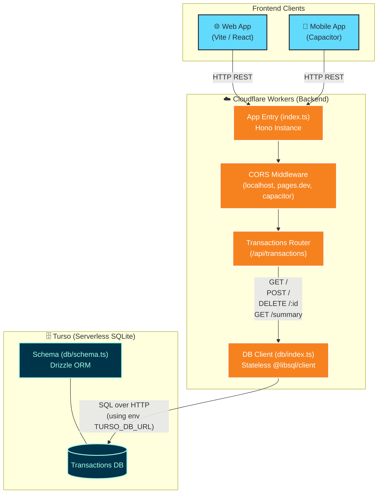

# Backend Architecture

현재 백엔드의 구조를 시각화한 아키텍처 다이어그램입니다.

## 주요 컴포넌트 설명

1. **Frontend Clients**: 
   - Hono 백엔드는 `cors` 미들웨어를 통해 로컬호스트(`http://localhost:5173`), 브라우저 배포 환경, 그리고 모바일 앱(`capacitor://localhost`)からの Cross-Origin 요청을 허용합니다.

2. **Cloudflare Workers**: 
   - 서버리스 환경에서 실행되며 요청이 들어올 때마다 상태없는(Stateless) 방식으로 작동합니다.
   - `Hono` 라우터가 엔드포인트를 매핑하고 데이터베이스 쿼리에 필요한 클라이언트를 매번 새롭게 생성하여 Turso로 요청을 보냅니다.
   - 트랜잭션과 관련된 모든 비즈니스 로직(조회, 추가, 삭제, 월별 요약)은 `routes/transactions.ts`에서 처리됩니다.

3. **Turso Database**:
   - `Drizzle ORM` 스키마를 바탕으로 SQLite 데이터베이스가 동작합니다.
   - `@libsql/client`를 사용하여 HTTPS로 쿼리를 실행하므로 클라우드 환경에서 빠르고 일관되게 접근합니다.
