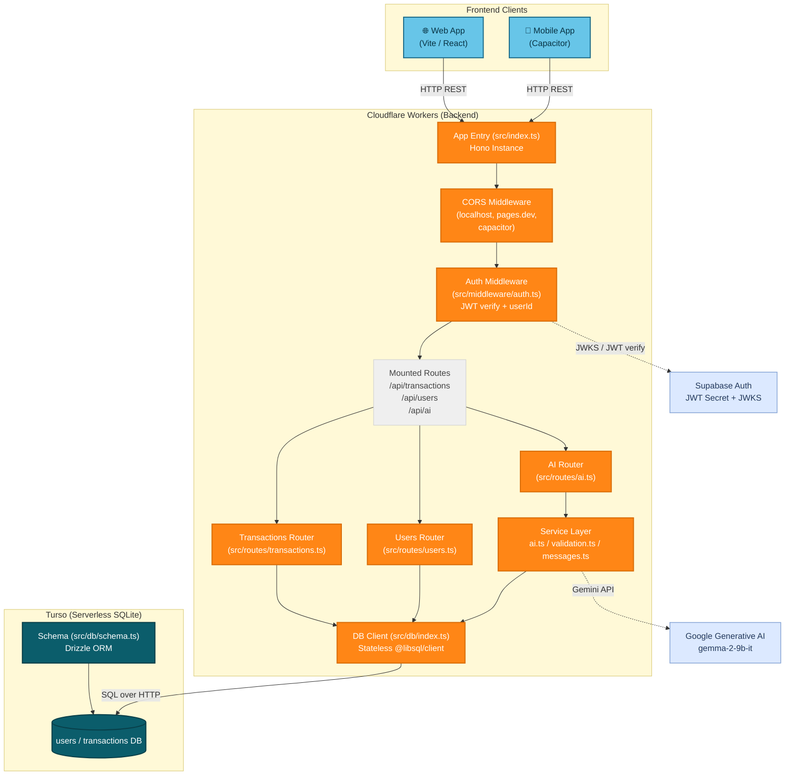
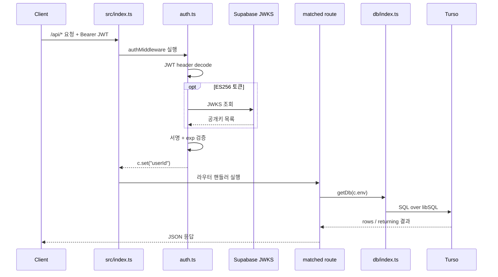
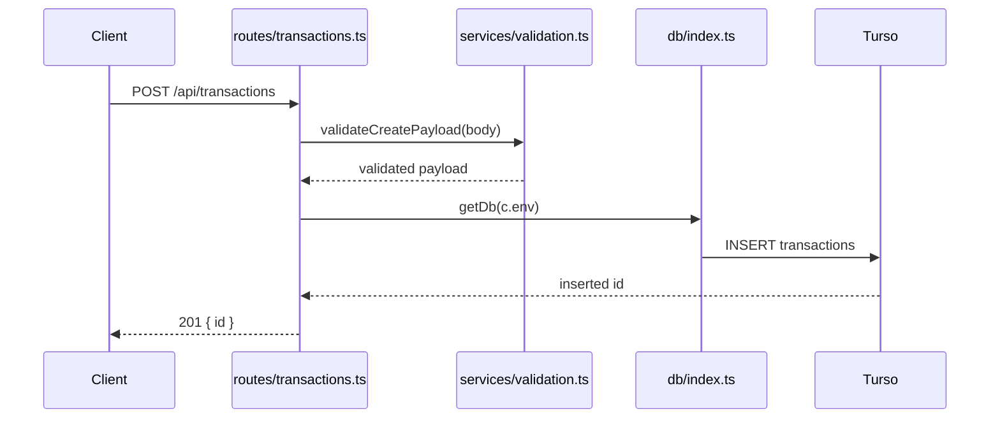
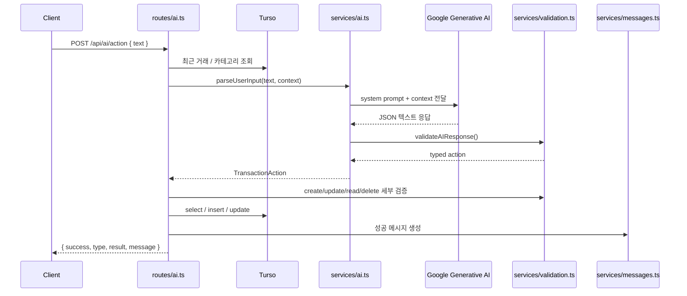

# FastSaaS Backend 코드 기준 통합 가이드

이 문서는 `FastSaaS02_Track01_1/backend`의 현재 실제 소스코드를 기준으로 백엔드 구조를 정리한 통합 문서입니다.

- 추상 설계가 아니라 현재 존재하는 파일과 경로를 기준으로 설명합니다.
- 기준 소스: `src/index.ts`, `src/routes/*`, `src/services/*`, `src/db/*`, `src/middleware/*`, `tests/*`
- 기존 `backend_architecture.md`와 `backend_structure.md` 내용을 이 문서로 합쳤습니다.

## 1. 시스템 아키텍처



## 2. 레이어별 구성

| 레이어 | 사용 기술 | 실제 소스 |
| --- | --- | --- |
| Runtime | Cloudflare Workers, Wrangler | `wrangler.jsonc`, `src/index.ts` |
| HTTP | Hono, CORS | `src/index.ts` |
| Auth | 커스텀 JWT 검증, Supabase JWKS | `src/middleware/auth.ts` |
| Database | Turso, `@libsql/client`, Drizzle ORM | `src/db/index.ts`, `src/db/schema.ts`, `drizzle.config.ts` |
| Route Layer | Transactions, Users, AI 엔드포인트 | `src/routes/transactions.ts`, `src/routes/users.ts`, `src/routes/ai.ts` |
| Service Layer | Gemini 연동, 메시지 생성, 검증 | `src/services/ai.ts`, `src/services/messages.ts`, `src/services/validation.ts` |
| Type Layer | AI 액션 타입 정의 | `src/types/ai.ts` |
| Test | Vitest | `vitest.config.ts`, `src/middleware/auth.test.ts`, `tests/*` |

## 3. 폴더 구조

### 3.1 구조 다이어그램

```mermaid
graph TD
    Backend["backend/"]

    Backend --- RootConfig["package.json<br/>wrangler.jsonc<br/>drizzle.config.ts<br/>tsconfig.json<br/>vitest.config.ts"]
    Backend --- RootEtc["README.md<br/>test_connection.js<br/>package-lock.json"]
    Backend --- Drizzle["drizzle/"]
    Backend --- Src["src/"]
    Backend --- Tests["tests/"]

    Src --- Index["index.ts"]
    Src --- Db["db/"]
    Src --- Middleware["middleware/"]
    Src --- Routes["routes/"]
    Src --- Services["services/"]
    Src --- Types["types/"]

    Db --- DbIndex("index.ts")
    Db --- DbSchema("schema.ts")

    Middleware --- Auth("auth.ts")
    Middleware --- AuthTest("auth.test.ts")

    Routes --- TxRoute("transactions.ts")
    Routes --- UserRoute("users.ts")
    Routes --- AIRoute("ai.ts")

    Services --- AISvc("ai.ts")
    Services --- Messages("messages.ts")
    Services --- Validation("validation.ts")

    Types --- AITypes("ai.ts")

    Drizzle --- SqlFiles("0000_*.sql<br/>0001_*.sql")
    Drizzle --- Meta("meta/")

    Tests --- RouteTests("routes/")
    Tests --- ServiceTests("services/")
    RouteTests --- RouteTxTest("transactions.test.ts")
    RouteTests --- RouteAITest("ai.test.ts")
    ServiceTests --- MsgTest("messages.test.ts")
    ServiceTests --- ValTest("validation.test.ts")

    classDef mainFolder fill:#2D7B93,stroke:#2D7B93,stroke-width:2px,color:#fff,rx:8px,ry:8px,font-weight:bold;
    classDef folder fill:#DE9033,stroke:#DE9033,stroke-width:2px,color:#fff,rx:8px,ry:8px,font-weight:bold;
    classDef subFolder fill:#65A8B2,stroke:#65A8B2,stroke-width:2px,color:#fff,rx:8px,ry:8px,font-weight:bold;
    classDef file fill:#BDBDBD,stroke:#BDBDBD,stroke-width:2px,color:#333,rx:8px,ry:8px;

    class Backend mainFolder;
    class Drizzle,Src,Tests folder;
    class Db,Middleware,Routes,Services,Types,RouteTests,ServiceTests,Meta subFolder;
    class RootConfig,RootEtc,Index,DbIndex,DbSchema,Auth,AuthTest,TxRoute,UserRoute,AIRoute,AISvc,Messages,Validation,AITypes,SqlFiles,RouteTxTest,RouteAITest,MsgTest,ValTest file;
```



### 3.2 트리 보기

```txt
backend/
|-- README.md
|-- drizzle.config.ts
|-- package.json
|-- package-lock.json
|-- test_connection.js
|-- tsconfig.json
|-- vitest.config.ts
|-- wrangler.jsonc
|-- drizzle/
|   |-- 0000_calm_ben_grimm.sql
|   |-- 0001_pretty_jamie_braddock.sql
|   `-- meta/
|       |-- 0000_snapshot.json
|       |-- 0001_snapshot.json
|       `-- _journal.json
|-- src/
|   |-- index.ts
|   |-- db/
|   |   |-- index.ts
|   |   `-- schema.ts
|   |-- middleware/
|   |   |-- auth.ts
|   |   `-- auth.test.ts
|   |-- routes/
|   |   |-- ai.ts
|   |   |-- transactions.ts
|   |   `-- users.ts
|   |-- services/
|   |   |-- ai.ts
|   |   |-- messages.ts
|   |   `-- validation.ts
|   `-- types/
|       `-- ai.ts
`-- tests/
    |-- routes/
    |   |-- ai.test.ts
    |   `-- transactions.test.ts
    `-- services/
        |-- messages.test.ts
        `-- validation.test.ts
```

### 3.3 폴더별 역할

| 경로 | 역할 |
| --- | --- |
| `backend/` | 실행, 배포, 마이그레이션, 테스트 설정이 모이는 루트 |
| `backend/drizzle/` | Drizzle이 생성한 SQL 마이그레이션과 스냅샷 |
| `backend/src/` | 실제 런타임 코드 |
| `backend/src/db/` | Turso 연결과 Drizzle 스키마 |
| `backend/src/middleware/` | 인증 미들웨어와 근접 단위 테스트 |
| `backend/src/routes/` | HTTP 엔드포인트 진입점 |
| `backend/src/services/` | 라우트에서 분리한 재사용 로직 |
| `backend/src/types/` | AI 액션 관련 타입 정의 |
| `backend/tests/` | 라우트/서비스 테스트 |

### 3.4 파일 배치 원칙

#### `src/index.ts`

- 백엔드 단일 엔트리포인트
- CORS 설정
- `/api/*` 인증 미들웨어 연결
- `transactions`, `users`, `ai` 라우트 마운트

#### `src/db/*`

- `index.ts`: `getDb(env)`로 Drizzle client 생성
- `schema.ts`: `users`, `transactions` 테이블 정의

#### `src/middleware/*`

- `auth.ts`: Supabase JWT 검증, `userId` 주입
- `auth.test.ts`: `verifyJWT()` 테스트

#### `src/routes/*`

- `transactions.ts`: 거래 CRUD, 요약, undo
- `users.ts`: 사용자 sync, 내 정보 조회
- `ai.ts`: 자연어 입력을 CRUD 액션으로 처리

#### `src/services/*`

- `ai.ts`: Gemini 모델 호출
- `messages.ts`: 한국어 응답 메시지 생성
- `validation.ts`: Zod 기반 입력 검증

#### `tests/*`

- `tests/routes/*`: 라우트 단위 테스트
- `tests/services/*`: 서비스 함수 단위 테스트

## 4. 엔트리포인트와 라우팅

현재 백엔드의 요청 진입점은 `src/index.ts` 하나입니다.

1. `cors()` 미들웨어가 모든 요청에 먼저 적용됩니다.
2. `/api/*` 경로는 전부 `authMiddleware`를 통과해야 합니다.
3. 인증이 끝나면 아래 3개 라우터로 분기됩니다.

| 경로 | 파일 | 역할 |
| --- | --- | --- |
| `/api/transactions` | `src/routes/transactions.ts` | 거래 조회, 생성, 삭제, 요약, undo |
| `/api/users` | `src/routes/users.ts` | OAuth 로그인 후 사용자 동기화, 내 정보 조회 |
| `/api/ai` | `src/routes/ai.ts` | 자연어 입력을 CRUD 액션으로 변환 |

## 5. 공통 요청 흐름

모든 보호된 API는 아래 흐름을 공유합니다.



### 인증 계층 핵심 포인트

- `auth.ts`는 `HS256`과 `ES256` 두 방식의 JWT를 모두 처리합니다.
- `ES256`인 경우 Supabase의 `/.well-known/jwks.json`을 조회하고 1시간 캐시합니다.
- 성공 시 `userId`를 Hono context 변수에 주입하고, 이후 라우트는 이 값을 신뢰합니다.
- 결과적으로 모든 데이터 접근은 "현재 로그인한 사용자 기준"으로 제한됩니다.

## 6. Transactions 라우트 구조

`src/routes/transactions.ts`는 전통적인 CRUD + 통계 + soft delete 복원까지 담당합니다.

| 메서드 | 경로 | 동작 |
| --- | --- | --- |
| `GET` | `/api/transactions` | 본인 거래 목록 조회, `?date=YYYY-MM` 필터 지원 |
| `POST` | `/api/transactions` | 거래 생성 |
| `DELETE` | `/api/transactions/:id` | soft delete |
| `GET` | `/api/transactions/summary` | 월별 카테고리 합계 |
| `POST` | `/api/transactions/:id/undo` | soft delete 복원 |

### Transactions 생성 흐름



### Transactions 설계 포인트

- `deletedAt` 컬럼을 사용하는 soft delete 구조입니다.
- 조회와 요약은 항상 `deletedAt IS NULL` 조건을 추가합니다.
- 생성 시 `userId`는 클라이언트 입력이 아니라 서버가 `authMiddleware`에서 주입한 값으로 고정합니다.
- 요약 API는 `SUM(amount)`와 `groupBy(type, category)`를 사용합니다.

## 7. AI 라우트 구조

`src/routes/ai.ts`는 자연어를 받아 거래 CRUD 액션으로 바꾸고 실행합니다.

### 처리 단계

1. 요청 본문에서 `text`를 받습니다.
2. DB에서 최근 거래 10건과 사용자 카테고리 목록을 조회합니다.
3. `AIService.parseUserInput()`이 Gemini 모델에 프롬프트를 보냅니다.
4. 모델 응답을 `validateAIResponse()`로 1차 검증합니다.
5. 액션 타입에 따라 `create/update/read/delete`용 상세 검증을 다시 수행합니다.
6. 최종적으로 DB 작업을 실행하고 `messages.ts`로 한국어 응답 문구를 만듭니다.

### AI 액션 흐름



### AI 관련 파일 분리 원칙

- `routes/ai.ts`: 요청 orchestration과 최종 DB 작업
- `services/ai.ts`: Gemini 모델 호출과 JSON 파싱
- `services/validation.ts`: Zod 기반 구조 검증과 보조 검증
- `services/messages.ts`: 한국어 응답 포맷 통일
- `types/ai.ts`: 액션 타입과 payload 타입 정의

## 8. 데이터 모델

현재 DB 스키마는 `users`, `transactions` 두 테이블입니다.

| 테이블 | 주요 컬럼 | 설명 |
| --- | --- | --- |
| `users` | `id`, `email`, `name`, `avatar_url`, `provider`, `created_at` | OAuth 로그인 사용자 저장 |
| `transactions` | `id`, `user_id`, `type`, `amount`, `category`, `memo`, `date`, `created_at`, `deleted_at` | 가계부 거래 저장, soft delete 지원 |

### 스키마 포인트

- `transactions.userId`는 `users.id`를 참조합니다.
- `transactions.type`은 `income` 또는 `expense`만 허용합니다.
- 날짜는 문자열 `YYYY-MM-DD` 형식으로 저장합니다.
- `deletedAt`이 `null`이면 활성 거래, 값이 있으면 삭제된 거래입니다.

## 9. 설정 파일과 환경 변수

### 주요 설정 파일

- `wrangler.jsonc`: Worker 엔트리포인트와 런타임 변수
- `drizzle.config.ts`: Drizzle migration 출력 위치와 Turso 접속 정보
- `vitest.config.ts`: 테스트 실행 환경
- `package.json`: 실행 스크립트와 의존성

### 현재 사용하는 환경 변수

| 변수명 | 사용 위치 | 용도 |
| --- | --- | --- |
| `TURSO_DB_URL` | `src/db/index.ts`, `drizzle.config.ts` | Turso 연결 URL |
| `TURSO_AUTH_TOKEN` | `src/db/index.ts`, `drizzle.config.ts` | Turso 인증 토큰 |
| `SUPABASE_JWT_SECRET` | `src/middleware/auth.ts` | HS256 JWT 검증 |
| `GEMINI_API_KEY` | `src/routes/ai.ts`, `src/services/ai.ts` | Gemini 호출 |

## 10. 테스트 구조

현재 테스트는 인증, 서비스, 라우트 단위로 나뉘어 있습니다.

| 파일 | 테스트 범위 |
| --- | --- |
| `src/middleware/auth.test.ts` | `verifyJWT()` 단위 테스트 |
| `tests/routes/ai.test.ts` | AI 액션 라우트 동작 검증 |
| `tests/routes/transactions.test.ts` | undo 관련 동작 기대값 검증 |
| `tests/services/messages.test.ts` | 메시지 생성 함수 검증 |
| `tests/services/validation.test.ts` | Zod 검증 및 보조 검증 함수 검증 |

## 11. 현재 구조 한 줄 요약

현재 FastSaaS 백엔드는 "Cloudflare Workers 위의 Hono 앱" 안에서, 인증된 사용자의 요청을 `routes -> services -> db` 구조로 흘려 보내고, AI 입력은 별도의 `services/ai.ts` 레이어를 통해 Gemini와 연결하는 형태로 정리되어 있습니다.
