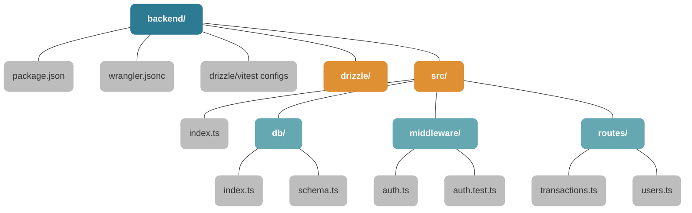

# Backend Folder Structure

해당 다이어그램은 제시해주신 이미지와 유사한 시각적 디자인(색상 체계 및 레이아웃)을 바탕으로 현재 `budget-app` 프로젝트의 백엔드 폴더 구조를 나타낸 것입니다.

위 구조의 역할은 다음과 같습니다:
- **`backend/`**: 백엔드 애플리케이션 최상위 디렉토리 (Cloudflare Workers 환경)
- **`src/`**: 실제 코드가 돌아가는 진입점(`index.ts`)과 라우트, 미들웨어가 위치
- **`db/`**: Turso(SQLite) 커넥션과 Drizzle ORM 테이블 스키마 정의
- **`middleware/`**: JWT 기반 사용자 인증 등 커스텀 미들웨어 로직
- **`routes/`**: 각 도메인별(사용자, 가계부내역) 엔드포인트 API 컨트롤러
