# FastSaaS Backend 폴더 구조

현재 `FastSaaS02_Track01_1/backend`의 실제 파일 기준 폴더 구조입니다.

- `node_modules` 같은 설치 산출물은 제외했습니다.
- 목적은 "어디에 무엇이 있는지"를 빠르게 파악하는 것입니다.
- 런타임 흐름은 `docs/backend_architecture.md`에서 설명합니다.

## 1. 폴더 구조 다이어그램

```mermaid
graph TD
    Backend["backend/"]

    Backend --- RootConfig["package.json<br/>wrangler.jsonc<br/>drizzle.config.ts<br/>tsconfig.json<br/>vitest.config.ts"]
    Backend --- RootEtc["README.md<br/>test_connection.js<br/>package-lock.json"]
    Backend --- Drizzle["drizzle/"]
    Backend --- Src["src/"]
    Backend --- Tests["tests/"]

    Src --- Index["index.ts"]
    Src --- Db["db/"]
    Src --- Middleware["middleware/"]
    Src --- Routes["routes/"]
    Src --- Services["services/"]
    Src --- Types["types/"]

    Db --- DbIndex("index.ts")
    Db --- DbSchema("schema.ts")

    Middleware --- Auth("auth.ts")
    Middleware --- AuthTest("auth.test.ts")

    Routes --- TxRoute("transactions.ts")
    Routes --- UserRoute("users.ts")
    Routes --- AIRoute("ai.ts")

    Services --- AISvc("ai.ts")
    Services --- Messages("messages.ts")
    Services --- Validation("validation.ts")

    Types --- AITypes("ai.ts")

    Drizzle --- SqlFiles("0000_*.sql<br/>0001_*.sql")
    Drizzle --- Meta("meta/")

    Tests --- RouteTests("routes/")
    Tests --- ServiceTests("services/")
    RouteTests --- RouteTxTest("transactions.test.ts")
    RouteTests --- RouteAITest("ai.test.ts")
    ServiceTests --- MsgTest("messages.test.ts")
    ServiceTests --- ValTest("validation.test.ts")

    classDef mainFolder fill:#2D7B93,stroke:#2D7B93,stroke-width:2px,color:#fff,rx:8px,ry:8px,font-weight:bold;
    classDef folder fill:#DE9033,stroke:#DE9033,stroke-width:2px,color:#fff,rx:8px,ry:8px,font-weight:bold;
    classDef subFolder fill:#65A8B2,stroke:#65A8B2,stroke-width:2px,color:#fff,rx:8px,ry:8px,font-weight:bold;
    classDef file fill:#BDBDBD,stroke:#BDBDBD,stroke-width:2px,color:#333,rx:8px,ry:8px;

    class Backend mainFolder;
    class Drizzle,Src,Tests folder;
    class Db,Middleware,Routes,Services,Types,RouteTests,ServiceTests,Meta subFolder;
    class RootConfig,RootEtc,Index,DbIndex,DbSchema,Auth,AuthTest,TxRoute,UserRoute,AIRoute,AISvc,Messages,Validation,AITypes,SqlFiles,RouteTxTest,RouteAITest,MsgTest,ValTest file;
```



## 2. 트리 보기

```txt
backend/
|-- README.md
|-- drizzle.config.ts
|-- package.json
|-- package-lock.json
|-- test_connection.js
|-- tsconfig.json
|-- vitest.config.ts
|-- wrangler.jsonc
|-- drizzle/
|   |-- 0000_calm_ben_grimm.sql
|   |-- 0001_pretty_jamie_braddock.sql
|   `-- meta/
|       |-- 0000_snapshot.json
|       |-- 0001_snapshot.json
|       `-- _journal.json
|-- src/
|   |-- index.ts
|   |-- db/
|   |   |-- index.ts
|   |   `-- schema.ts
|   |-- middleware/
|   |   |-- auth.ts
|   |   `-- auth.test.ts
|   |-- routes/
|   |   |-- ai.ts
|   |   |-- transactions.ts
|   |   `-- users.ts
|   |-- services/
|   |   |-- ai.ts
|   |   |-- messages.ts
|   |   `-- validation.ts
|   `-- types/
|       `-- ai.ts
`-- tests/
    |-- routes/
    |   |-- ai.test.ts
    |   `-- transactions.test.ts
    `-- services/
        |-- messages.test.ts
        `-- validation.test.ts
```

## 3. 폴더별 역할

| 경로 | 역할 |
| --- | --- |
| `backend/` | 실행, 배포, 마이그레이션, 테스트 설정이 모이는 루트 |
| `backend/drizzle/` | Drizzle이 생성한 SQL 마이그레이션과 스냅샷 |
| `backend/src/` | 실제 런타임 코드 |
| `backend/src/db/` | Turso 연결과 Drizzle 스키마 |
| `backend/src/middleware/` | 인증 미들웨어와 근접 단위 테스트 |
| `backend/src/routes/` | HTTP 엔드포인트 진입점 |
| `backend/src/services/` | 라우트에서 분리한 재사용 로직 |
| `backend/src/types/` | AI 액션 관련 타입 정의 |
| `backend/tests/` | 라우트/서비스 테스트 |

## 4. 파일 배치 원칙

### `src/index.ts`

- 백엔드 단일 엔트리포인트
- CORS 설정
- `/api/*` 인증 미들웨어 연결
- `transactions`, `users`, `ai` 라우트 마운트

### `src/db/*`

- `index.ts`: `getDb(env)`로 Drizzle client 생성
- `schema.ts`: `users`, `transactions` 테이블 정의

### `src/middleware/*`

- `auth.ts`: Supabase JWT 검증, `userId` 주입
- `auth.test.ts`: `verifyJWT()` 테스트

### `src/routes/*`

- `transactions.ts`: 거래 CRUD, 요약, undo
- `users.ts`: 사용자 sync, 내 정보 조회
- `ai.ts`: 자연어 입력을 CRUD 액션으로 처리

### `src/services/*`

- `ai.ts`: Gemini 모델 호출
- `messages.ts`: 한국어 응답 메시지 생성
- `validation.ts`: Zod 기반 입력 검증

### `tests/*`

- `tests/routes/*`: 라우트 단위 테스트
- `tests/services/*`: 서비스 함수 단위 테스트

## 5. 구조 해석 포인트

- 현재 구조는 `index -> middleware -> routes -> services/db`로 내려가는 전형적인 얇은 라우트 구조입니다.
- AI 기능이 `routes/ai.ts` 하나에 몰리지 않도록 `services/ai.ts`, `services/messages.ts`, `services/validation.ts`로 분리되어 있습니다.
- DB 관련 관심사는 `src/db/`에 모여 있어서 라우트 레벨에서 SQL 세부 구현이 새지 않습니다.
- 테스트는 `src` 옆 `tests/`에 분리되어 있지만, 인증 테스트만 `auth.ts` 옆에 붙어 있습니다.
