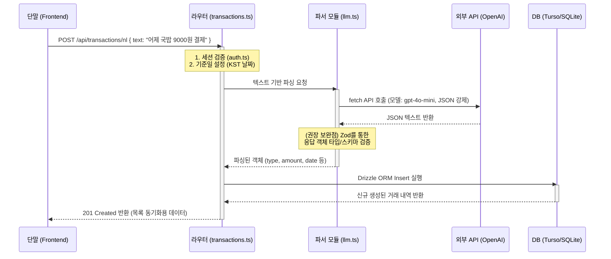
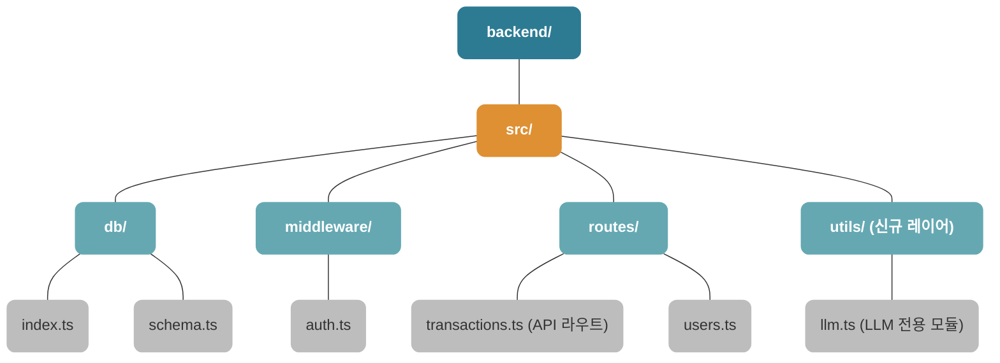

# 자연어 가계부 입력 시스템 아키텍처 (LLM NL System Architecture)

본 문서는 LLM을 활용한 자연어 가계부 입력 기능의 데이터 흐름과 새롭게 갱신된 백엔드의 파일/폴더 구조를 시각화한 아키텍처 문서입니다.

## 1. 누락 점검 및 설계 보완점 (Validation Review)
이론적 설계와 파이프라인 구조 상 큰 기능의 누락은 없습니다 (입력 -> LLM 호출 -> 파싱 -> DB 저장 의 흐름은 완벽합니다). 
다만 실제 프로덕션 도입 시 생길 수 있는 예외 상황에 대비하여 **단 하나의 필수적인 보완점**이 발견되었습니다.

* **LLM 응답 타입 검증 (Schema Validation) 계층 부재**
  - 현재는 `JSON.parse()` 로만 데이터를 믿고 넘기고 있습니다. 만약 LLM이 지시를 어기고 `amount: "5400원"` 이나 `type: "buy"` 등 규격 외의 값을 내뱉게 되면, DB 삽입 시 타입 에러나 런타임 오류가 발생할 수 있습니다.
  - **해결 및 권장 사항**: 프론트엔드/백엔드 생태계의 표준 검증 툴인 `Zod` 라이브러리를 통해 추출한 JSON의 타입(비용은 반드시 `number`, 날짜는 정규식 검사 등)을 안전하게 한 번 더 파싱(Parse)하고 방어하는 로직이 `src/utils/llm.ts` 쪽에 한계층 더해져야 완벽한 시스템이 됩니다.

---

## 2. 데이터 흐름 다이어그램 (Sequence Flow)
LLM 모듈과 외부 모델, 그리고 데이터베이스가 어떻게 상호작용하는지 시간 순서대로 나타낸 시퀀스 다이어그램입니다.

---

## 3. 업데이트된 폴더 아키텍처 구조 (Module Structure)
비즈니스 로직(LLM 기능)이 라우터와 섞이지 않도록 `utils/` 디렉토리를 신설하여 의존향을 분리한 새 아키텍처 다이어그램입니다.

